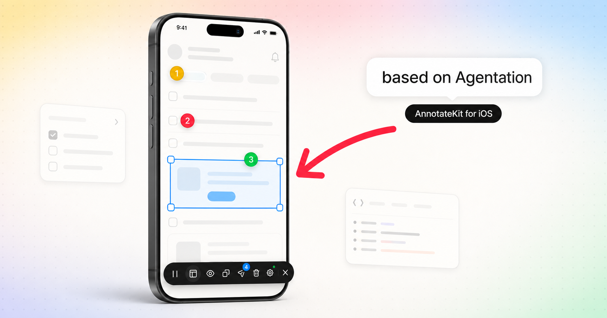

# AnnotateKit

**Visual feedback. For agents. On iOS.**

<p align="center">
  
</p>

> 🧬 **Based on [Agentation](https://www.agentation.com/)** — this is, openly and deliberately, the iOS version of Benji Taylor's Agentation. Same workflow, same design language, same schema, same companion server. Independent Swift code, full credit to the original. Building for the web? [Use Agentation itself](https://www.agentation.com/).

AnnotateKit brings Agentation's idea to native iOS: click any element, write a note, and hand an AI coding agent structured context it can act on. Web developers have Agentation; native iOS apps had nothing. Describing UI feedback to an agent meant typing "the blue button under the second card, no, the other one…".

AnnotateKit closes that gap with the same workflow, the same design language, the same annotation schema, and even the same companion server: tap the floating toolbar in your Debug build, tap any element, type a note. Your agent gets the element's accessibility identity (the iOS equivalent of a CSS selector), grep-ready nearby texts, view chain, computed styles, a marked screenshot — and, if you run [`agentation-mcp`](https://github.com/benjitaylor/agentation), the annotation appears to your agent **in real time over MCP, no copy-paste at all**.

> **Provenance, openly stated:** this project deliberately mirrors Agentation's feature set and look so iOS developers get the tool web developers already love. It contains **no Agentation code or assets** — it is an independent Swift implementation (Agentation is React/TypeScript, licensed under PolyForm Shield 1.0.0; AnnotateKit is MIT). Agentation is a product by Benji Taylor, Dennis Jin and Alex Vanderzon; AnnotateKit is not affiliated with or endorsed by them. If you build for the web, use the original.

## Install

Swift Package Manager:

```swift
dependencies: [
    .package(url: "https://github.com/Connected-Mate/AnnotateKit", from: "0.2.0")
]
```

Or in Xcode: **File → Add Package Dependencies…** and paste the repo URL.

Requirements: iOS 17+ (Mac Catalyst supported), Swift 5.9+.

## Usage

One modifier, near the root of your app:

```swift
import AnnotateKit

struct RootView: View {
    var body: some View {
        MainTabView()
            .annotationOverlay()
    }
}
```

That's it. **In Release builds the modifier compiles to an inert `self`** — no debug UI, files, or logs can ship to TestFlight or the App Store, so you can leave it in place permanently.

Optional configuration (call once, e.g. in `App.init`):

```swift
AnnotateKit.configure(
    appGroupIdentifier: "group.com.example.myapp",       // files in the App Group container
    logSubsystem: "com.example.myapp",                    // OSLog subsystem for the JSON stream
    endpoint: URL(string: "http://your-mac.local:4747"),  // agentation-mcp server → real-time MCP
    webhookURL: URL(string: "https://example.com/hook"),  // POST output on Send
    callbacks: AnnotateKitCallbacks(
        onAnnotationAdd: { json in print("added:", json) },
        onCopy: { output in /* … */ }
    )
)
```

Everything is also configurable at runtime from the toolbar's settings panel (accent color, dark/light theme, marker tap behavior, output detail level, server endpoint, webhook URL).

## The workflow

1. **Tap the dark circle** bottom-right (drag it anywhere; the position sticks).
2. The toolbar expands and annotation mode starts — **hover** (trackpad/Catalyst) highlights the element under the pointer, Agentation-style.
3. **Tap an element** → a dark popup opens with the element's identity. Type what's wrong, optionally tag an **intent** (fix / change / question / approve) and a **severity** (blocking / important / suggestion), submit.
4. A **numbered marker** lands on the element. Tap a marker to edit (or delete — your choice in settings). Markers, notes and screenshots persist across relaunches, pruned after 7 days.
5. **Copy** puts the compiled markdown prompt on the pasteboard. **Send** posts it to your server/webhook. Or let MCP deliver everything live (below).

Beyond single taps:

- **Drag a rectangle** to annotate several elements at once (multi-select).
- **Draw mode** — freehand strokes over the UI, attached to the annotation and burned into its screenshot.
- **Layout mode** — drag an element to propose a move (recorded as a `rearrange` with before/after rects), two-finger-tap to drop a placeholder block (`placement`). Proxies only; your app is never mutated.
- **Freeze animations** — pauses every Core Animation in the app so you can annotate a specific frame (SwiftUI's own value-driven animations keep running — see Limitations).
- **Text capture** — tapping a text element quotes its content in the annotation, for typo reports.

Hardware keyboard (Catalyst / iPad / simulator), same keys as the web tool while the tool is active: `⌘⇧F` toggle, `P` freeze, `L` layout, `H` hide/show markers, `C` copy, `X` clear all, `S` send, `Esc` cascade-exit.

## Getting annotations to your agent

Five transports, use whichever fits your loop:

1. **MCP, real time (the good one)** — run Agentation's own companion server on your Mac and point AnnotateKit at it:
   ```bash
   npx agentation-mcp server   # HTTP + MCP on :4747
   ```
   ```swift
   AnnotateKit.configure(endpoint: URL(string: "http://127.0.0.1:4747")) // simulator
   // device: use your Mac's LAN address, e.g. http://192.168.1.20:4747
   ```
   AnnotateKit speaks the same wire protocol as the web tool: it creates a session, pushes each annotation as you save it, and listens on SSE. Your agent connects over MCP and uses the standard Agentation tools (`agentation_get_pending`, `agentation_watch_annotations`, `agentation_resolve`, `agentation_reply`, …). **When the agent resolves or dismisses an annotation, it disappears from your device in real time.** Intent, severity, status and threads round-trip — the annotation schema is Agentation's, field for field.
2. **Pasteboard** — *Copy* puts the markdown prompt on the pasteboard; Universal Clipboard forwards it to your Mac.
3. **Webhook** — *Send* (or `S`) POSTs an Agentation `ActionRequest` (`{sessionId, annotations, output, timestamp}`, `User-Agent: Agentation-Webhook/1.0`) to your URL, directly or through the server's own webhook fan-out.
4. **Live log stream** — every saved annotation is emitted as one OSLog line, `ANNOTATEKIT {json}` (category `AnnotateKit`):
   ```bash
   log stream --predicate 'category == "AnnotateKit"' --style compact
   ```
5. **Files** — `annotations.md` (the compiled prompt), `annotations.json` (full schema) and marked screenshots in `Documents/AnnotateKit/`, or the App Group container. With Mac Catalyst that's a plain folder an agent on the Mac can read directly.

## Output

Four detail levels (compact / standard / detailed / forensic), selectable in settings — same ladder as Agentation:

```markdown
## UI Feedback: MyApp
**Viewport:** 402×874 pt — iPhone iOS 26.4

### 1. Button “Start recording”
**Location:** Button #record-button
**Screen:** Recordings
**Intent:** fix — important
**Feedback:** This button is too small and overlaps the card below
```

`detailed` adds identifiers, class names, position, context and the screenshot path; `forensic` adds an environment block, computed styles, accessibility summary, nearby elements and the UIKit view chain.

## How it works

- A **passthrough `UIWindow`** sits above the app (the classic debug-tool pattern). Its `hitTest` only claims touches on the toolbar, the markers, in annotation mode, or while a popup is open — the rest of the time your app behaves as if it weren't there.
- On tap, AnnotateKit walks the **accessibility tree** of the app's window and picks the smallest element containing the tap point (falling back to the nearest within 44 pt). The accessibility tree is the iOS analogue of the DOM: labels, roles, identifiers, frames — and it gets sharper as you adopt accessibility best practices.
- SwiftUI materialises its accessibility tree only for assistive clients, so Debug builds flip the same switch UI-testing uses (`AXSSetAutomationEnabled`, via `dlopen` — compiled only under `#if DEBUG`, never shipped).
- Labels are localized at runtime, so the generated prompt reminds the agent to check your String Catalog / `.lproj` files when a literal doesn't appear in Swift sources.

## Feature parity with Agentation (web)

| Agentation (web) | AnnotateKit (iOS) |
|---|---|
| Toolbar (44 px circle ↔ pill, dark `#1a1a1a`, draggable, entrance animation) | Same, in points, same easing curves |
| 7 accent colors (sRGB + Display P3) | Same values |
| Hover highlight + element name | Pointer hover (Catalyst/iPad); tap flash on touch |
| Click-to-annotate, numbered markers, edit/delete on marker click | Same |
| Multi-select (drag rectangle) | Same (8 pt threshold, like the web) |
| Text selection capture | Tapped text elements are quoted |
| Freeze animations (`P`) | Core Animation freeze (see Limitations) |
| Design/layout mode (`L`): placement + rearrange | Proxy-rect move + placeholder blocks |
| Draw mode | Freehand strokes, in screenshots too |
| Keyboard shortcuts | Same keys, hardware keyboards |
| localStorage persistence, 7-day retention | JSON on disk, same retention |
| Settings (accent, theme, marker behavior, webhooks) | Same, plus output detail level |
| Schema: `intent`, `severity`, `status`, `thread` | Same fields, wire-compatible |
| MCP server + SSE + bidirectional resolve | **Same server**, unmodified |
| Webhooks (`ActionRequest`) | Same payload + User-Agent |
| React component tree, source file:line | Not possible on iOS — see below |

## Limitations

- **No file/line.** SwiftUI doesn't expose source locations at runtime (the web tool reads React fibers). The bridge is accessibility identity + grep hints; adding `accessibilityIdentifier` to key views makes annotations sharper.
- **Freeze is Core Animation only.** UIKit animations, transitions and `CAAnimation`s freeze; SwiftUI's value-driven animations (e.g. `.repeatForever`) are driven by SwiftUI's own clock and keep running — there is no public API to pause it.
- **Markers are window-anchored.** iOS has no document scroll to track, so a marker doesn't follow content scrolled under it; the screenshot preserves the original context.
- Elements hidden from accessibility fall back to the UIKit view-chain description.
- One overlay per window scene (first scene wins on iPad/Catalyst multi-window).

## Credits & license

AnnotateKit is inspired by — and a deliberate iOS port of the ideas of — **[Agentation](https://www.agentation.com/)**, created by Benji Taylor with Dennis Jin and Alex Vanderzon. Not affiliated, not endorsed. No Agentation source code or assets are included; the Agentation software itself is licensed under PolyForm Shield 1.0.0 — for web projects, use the original and support them.

AnnotateKit's own code is MIT — see [LICENSE](LICENSE).
